<div align="center">


[](https://nodejs.org/)
[](https://expressjs.com/)
[](https://telegraf.js.org/)
[](https://socket.io/)
[](https://mongodb.com/)
[](https://telegram.org/)
[](.)
[](.)
[](https://github.com/jundy779/Auto_Order_BOT)
[](https://github.com/jundy779/Auto_Order_BOT)

**🎯 Jualan Autopilot 24/7 • 💳 15 Payment Gateway • 🌏 Indonesia • Malaysia • India • Crypto • 🖥️ Admin Panel Modern**

[Demo Bot](https://t.me/FusionTempest_bot) • [Order Sekarang](#-order-sekarang) • [Hubungi Saya](#-hubungi-saya)


</div>

---

## 📑 Daftar Isi

| | |
|:---|:---|
| [🏗️ Arsitektur](#-arsitektur-bot-auto-order) | [💳 Payment Gateway](#-payment-gateway-supported) |
| [🆕 Terbaru](#-terbaru) | [🖥️ Admin Panel](#️-admin-panel-preview) |
| [🚀 Kenapa Pilih Bot Ini](#-kenapa-pilih-bot-ini) | [🎯 Cocok Untuk Jualan](#-cocok-untuk-jualan) |
| [✨ Fitur Premium](#-fitur-premium) | [📦 Fitur Lengkap](#-fitur-lengkap) |
| [⚖️ Perbandingan](#️-perbandingan) | [🔬 Engineering Deep-Dive](#-engineering-deep-dive) |
| [🛠️ Tech Stack](#️-tech-stack) | [📈 Performance Benchmarks](#-performance-benchmarks) |
| [🗺️ Roadmap](#-roadmap) | [📁 Folder Structure](#-folder-structure) |
| [❓ FAQ](#-faq) | [🧭 Dokumentasi Teknis](#-dokumentasi-teknis-developer) |
| [📋 Task & Progress](#-task--progress-developer) | [🛒 Paket Harga](#-paket-harga) |
| [📞 Hubungi Saya](#-hubungi-saya) | |

---

## 🆕 Terbaru

- **🎨 Bot Appearance Phase 1/2** — Admin `/admin/bot-appearance` bisa simpan draft/publish live ke DB; `/start` memakai welcome text, label menu, inline shortcut, dan banner foto custom dengan fallback aman.
- **🎨 Admin PG v8.8.2** — halaman `/admin/gateways` pakai sidebar seperti dashboard; badge gateway **X/15** (bukan 12); serve CSS `/css` fix UI rusak.
- **🤖 Bot UX v8.8.2** — welcome `/start` aman untuk username dengan `_`; keyboard `/admin` grid 2 kolom.
- **💳 Casaku v8.8.1** — payment gateway QRIS Indonesia (`api.casaku.id`): checkout/top-up, polling 3 detik, webhook HMAC, tab admin + **Diagnostik Casaku** (profil → QRIS probe → check-status). Webhook: `{PUBLIC_URL}/casaku-callback`.
- **📱 PPOB v8.8.0** — cek saldo deposit DigiFlazz (admin + `/ppobsaldo`); submenu type Umum/Transfer; bayar prepaid via QRIS; riwayat inline + cek ulang.
- **⚙️ Admin PPOB Provider** — atur kredensial DigiFlazz (dan placeholder 3 provider) dari panel; penyewa bot tidak perlu isi `PPOB_*` di `.env`.
- **📱 PPOB prepaid hardening (8.7.9)** — polling status prepaid fix (re-topup); tampil SN/token ke user; `testing: true` saat `PPOB_DIGIFLAZZ_TESTING=true`.
- **📱 PPOB katalog & navigasi (8.7.8)** — sync tagihan DigiFlazz (`cmd: pasca`); menu 3 level kategori → brand → produk (Pulsa/Data/Games/E-Money/Pascabayar).
- **📱 PPOB tagihan postpaid (8.7.7)** — PLN/PDAM/internet via DigiFlazz: cek tagihan → konfirmasi harga dinamis → bayar dari saldo; sandbox `PPOB_DIGIFLAZZ_TESTING=true`.
- **🧩 Flow PPOB modular (8.7.6)** — Logic PPOB dipindah ke `features/user/flowPpob.js`; `bot.js` lebih ringan.
- **📱 PPOB markup + auto-sync (8.7.5)** — Admin atur markup %/biaya tetap; sync katalog otomatis terjadwal; toolbar PPOB admin hanya tampil di toko IDR; harga jual konsisten di bot & MongoDB.
- **🔥 Flash Sale broadcast (8.7.4)** — Admin bisa push notifikasi promo ke semua user Telegram (per bahasa) saat simpan/aktifkan flash sale.
- **🔔 Watchlist + qty favorit (8.7.3)** — Pantau produk habis (DM pribadi saat restock); simpan jumlah order favorit (⭐) di layar qty.
- **🔄 Beli lagi + bukti delivery (8.7.2)** — Tombol reorder dari riwayat/sukses; SLA garansi di checkout; hash bukti pengiriman 8 char di pesan sukses & riwayat.
- **📊 Seller analytics actionable (8.7.1)** — Admin → Analitik: produk sering abandon (bayar/qty), jam puncak restock vs konversi (WIB), saran "naikkan stok varian X jam HH:00".
- **🪙 Cryptomus USDT (8.7.0)** — Gateway kripto untuk checkout & top-up; invoice USD, default USDT/TRON; webhook `/cryptomus`; tab admin + env `CRYPTOMUS_*` + `PUBLIC_URL` HTTPS.
- **🛠️ Hotfix Bot API UX (8.6.16)** — QRIS kembali 1 pesan (foto + caption); `sendRichMessage` fallback plain di Desktop; expired QR format tanggal+jam WIB; **Salin stok** salin semua baris (qty>1).
- **🕐 Datetime rich + profil i18n (8.6.15)** — `tg://time` di invoice/riwayat/checkout; entity `date_time` plain; salin Ref ID + stok + efek confetti di sukses; `setMyName`/`Description` per bahasa (id/en/ms/zh/hi).
- **📨 Rich Messages P1+ (8.6.14)** — Bot API 10.1 diperluas: invoice pembelian, top-up sukses, riwayat transaksi, QR pending (foto + detail rich); reaksi 🎉 `setMessageReaction`; poll opsi + link URL; helper `date_time` + toggle admin (default OFF).
- **🗳️ Poll foto + deskripsi (8.6.13)** — header foto & deskripsi pada broadcast poll custom (bukan native `sendPoll`).
- **📨 Rich Messages invoice (8.6.12)** — Bot API 10.1: tabel ringkasan + stok spoiler saat pembelian sukses; toggle admin (default OFF, auto-fallback Markdown).
- **🔒 Force join join request (8.6.11)** — auto-approve channel/grup private dari admin panel; opsional Mini App HTTPS (Bot API 10.1 P3).
- **📋 Salin Ref ID + 🎉 efek bayar (8.6.10)** — tombol `copy_text` salin Ref ID di pesan pembayaran; efek confetti `message_effect_id` saat delivery sukses.
- **🧾 Tampilan produk katalog (8.6.9)** — daftar varian rapi (`1. Nama` + `💵 harga · ✅ stok/❌ Habis`), tombol nomor 1-N (5/baris), bisa ketik nomor manual.
- **⚡ Telegram API quick wins (8.6.8)** — indikator typing saat checkout/Stars; link preview dimatikan di pesan pembayaran; **admin → Telegram Stars**: saldo bot live via `getMyStarBalance` + riwayat API.
- **🎨 Tombol inline berwarna + emoji premium (8.6.7)** — `smartCallback` di seluruh keyboard bot (checkout, saldo, admin, PPOB, polling, dll.); **admin → Tombol Telegram**: validasi ID, preview ke Telegram, panduan operator; custom emoji di pesan biasa (auto HTML).
- **📦 Multi-varian produk (8.6.4)** — Satu produk bisa punya beberapa varian (mis. 1 Bulan / 3 Bulan) dengan harga & stok terpisah; user pilih varian di bot sebelum qty & bayar; kelola via admin products (JSON varian).
- **🔒 Reserve stok saat checkout (P1)** — Stok langsung di-hold saat user dapat link/invoice bayar (gateway + Stars), jadi tidak bisa oversell saat banyak orang checkout bersamaan.
- **📦 Auto-release stok (P0)** — Reserve yang belum selesai otomatis dikembalikan saat transaksi dibatalkan, expired, gagal, atau refund disetujui.
- **📊 Polling / vote broadcast (8.6.2)** — Admin buat polling **pilihan** atau **rating** dari bot (`/polling`) atau tab Broadcast admin web; user vote via tombol inline; hasil live di pesan yang di-vote; tutup otomatis/manual; **export CSV** suara dari bot (`/pollexport`) atau tombol **Export CSV** di panel hasil.
- **💰 Refund calculator & pengajuan** — User hitung estimasi refund (sisa hari garansi otomatis), lalu **ajukan refund** ke admin; approve/reject inline + kredit saldo atomik + **audit log admin**. Status garansi tampil di riwayat pembelian.
- **🧾 Refund Requests di admin panel** — Queue pengajuan refund kini bisa direview langsung dari web panel (filter status + approve/reject), sinkron dengan notifikasi user Telegram.
- **🔄 Session bot persist (8.6.1)** — Alur checkout/admin/refund tetap lanjut setelah restart container (Mongo TTL, tanpa Redis).
- **🛡️ Garansi refund (admin bot)** — Atur hari & fee % per tipe garansi lewat menu **Garansi Refund** atau `/garansiset` (tersimpan di database).
- **🔒 Hardening 8.6.0** — Anti double refund, dedupe `gatewayTransactionId`, polling gateway claim atomik, monitor/banned guard fail-closed di production.
- **🇮🇳 India (INR + UPI)** — Gateway **UPIExpress** untuk checkout & top-up (GPay / PhonePe / Paytm). Set `BASE_CURRENCY=INR` + `UPIEXPRESS_API_KEY`. Bahasa bot **हिन्दी** (`hi`) — **1017 key** alur Telegram (user + admin bot); regen: `node tools/generate-hi-user-texts.js && node tools/gen-hi-lang.js`.
- **🌍 Mode internasional** — Toko **MYR / INR / USD**: fokus **produk digital + panel Pterodactyl**; menu **PPOB disembunyikan** (PPOB khusus Indonesia).
- **📱 PPOB hanya kalau siap** — Meskipun `BASE_CURRENCY=IDR`, tombol PPOB **tidak muncul** sampai `PPOB_DIGIFLAZZ_ENABLED=true` + username + API key Digiflazz terisi.
- **🩺 Instance Health Dashboard** — Menu baru di **monitor panel** menampilkan status MongoDB, hit rate user cache (LRU + TTL), memory heap, dan PID/Node uptime per instance bot. Auto-refresh 10 detik + endpoint `GET /admin/health` (auth-protected) — **cocok untuk multi-tenant / multi-instance bot**.
- **⚡ Performance & Cache Layer** — User cache LRU + TTL untuk reduce MongoDB round-trip, fire-and-forget username update, dan auto-migration index startup. **16+ instance** bot bisa share satu MongoDB tanpa beban berlebih.
- **📊 BI-Ready CSV Export 3-mode** — Export analytics (`pretty` blok terbaca, `flat` single-sheet untuk Power BI/Tableau/Sheets, `timeseries` long-format per hari/minggu untuk chart tren). Export Laporan Overview juga dual-mode (pretty + flat 14-kolom RFC 4180).
- **🛡️ Anti Double-Order Idempotency** — RefId deterministik berbasis SHA-1 (userId+productKey+messageId+timeBucket) → klik berulang tombol bayar tidak akan pernah lagi menghasilkan transaksi ganda. Guarded di 3 lapisan: app cache + unique-index + atomic `$inc/$gte`.
- **💸 Transfer Saldo antar User** — User bisa kirim saldo ke sesama user (atomic, audit-log, limit configurable di admin).
- **📝 Manual Order System** — Untuk produk yang butuh data tambahan (username, email, server ID, dll.) — bot prompt user input → **stok langsung di-reserve saat order masuk** → kirim ke channel admin → admin proses dari dashboard Pending Orders.
- **🧾 Manual Order Audit Trail** — Lifecycle manual order sekarang terekam detail (actor, source, channel, status dari→ke, catatan admin, timestamp) untuk investigasi dispute/refund.
- **⏰ Manual Order SLA Reminder** — Scheduler otomatis ingatkan admin jika order manual terlalu lama di status `WAITING` (threshold/interval/cooldown configurable, anti-spam, optional broadcast ke channel admin).
- **✅ Confirm Selesai via bot admin** — Notifikasi order manual ke admin sekarang punya tombol inline untuk menandai order selesai langsung dari Telegram (stok otomatis berkurang + notif selesai ke user/channel).
- **🌏 Localization MS** — Term "garansi" diganti **"warranty"** di Bahasa Melayu (lebih natural untuk customer Malaysia).
- **🇲🇾 Panel Pterodactyl & gateway Malaysia** — Pembelian & perpanjang panel memakai **urutan gateway yang sama** seperti checkout produk digital & top-up saldo (ToyyibPay, Billplz, CHIP, QRIS, dll. sesuai admin). Tombol metode bayar mengikuti `payment_gateway_order` / mode `BASE_CURRENCY=MYR`.
- **💱 Multi-Currency Foundation (IDR/MYR/USD)** — `BASE_CURRENCY` switch toko, currency-aware formatter, & Phase 1 USD display ready. Native USD gateway = Phase 3+ (roadmap internal, dapat dishare on-request).
- **📱 PPOB Multi-Provider (Beta / In Development)** — Skeleton multi-provider PPOB (DigiFlazz, OkeConnect, SanPay, QiosPay) — adapter + admin sync + webhook **sudah dibuat tapi belum production-ready**, masih tahap hardening. Tidak default-on; dokumentasi lengkap tersedia on-request untuk early access.
- **15 Payment Gateway** — Pilih sesuai kebutuhan bisnis kamu (ID, MY, IN, crypto) — `.env` atau admin panel, hot-reload.

---

## 🏗️ Arsitektur Bot Auto Order

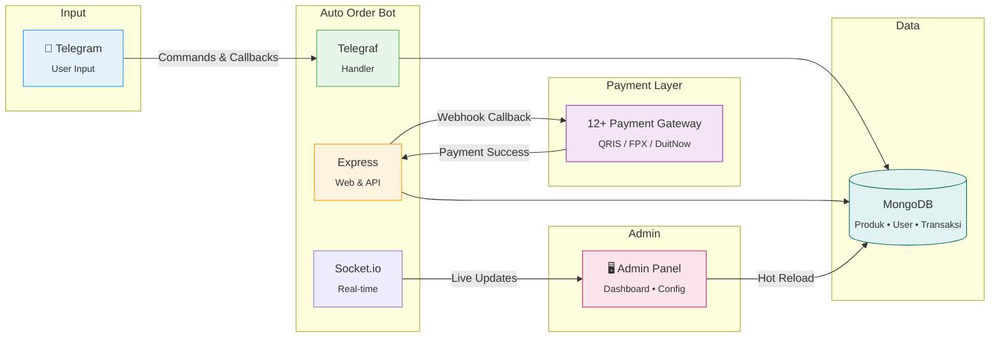

**✨ Key Features**

<table>
<tr>
<td align="center" width="33%">

**⚡ Performance**


Deteksi bayar &lt;3 detik
<br>Webhook real-time
<br>12+ gateway paralel

</td>
<td align="center" width="33%">

**🎯 Architecture**


Express + Telegraf
<br>Modular payment services
<br>Admin panel terintegrasi

</td>
<td align="center" width="33%">

**💾 Database**


MongoDB NoSQL
<br>Produk • User • Transaksi
<br>Hot reload tanpa restart

</td>
</tr>
</table>


## 🚀 Kenapa Pilih Bot Ini?

<table>
<tr>
<td>

### 😴 Tidur Pulas, Orderan Jalan

Bayangkan bangun tidur dan lihat saldo bertambah otomatis. Customer bayar QRIS → Produk terkirim **dalam 3 detik** tanpa kamu sentuh HP!

</td>
<td>

### 💰 Hemat Biaya Admin

Tidak perlu hire admin untuk handle orderan. Bot ini bekerja **24 jam non-stop** tanpa gajian, tanpa cuti, tanpa drama!

</td>
</tr>
<tr>
<td>

### 🌏 Multi-Region & Multi-Bahasa

Support pembayaran **Indonesia (QRIS)** dan **Malaysia** (ToyyibPay, Billplz, CHIP — FPX / DuitNow / e-wallet). Bot tersedia dalam 3 bahasa: Indonesia, English, Melayu.

</td>
<td>

### 🔄 Hot Reload Tanpa Restart

Ganti setting payment gateway, promo, atau konfigurasi lainnya **langsung dari admin panel** — tanpa perlu restart bot!

</td>
</tr>
</table>


## ⚖️ Perbandingan

<div align="center">

| | Bot Auto Order | Jualan Manual | Bot Lain (Umum) |
|:---|:---:|:---:|:---:|
| **Order 24/7** | ✅ | ❌ | ✅ |
| **Auto kirim produk** | ✅ <3 detik | ❌ | Varies |
| **12+ Payment Gateway** | ✅ ID + MY | ❌ | Terbatas |
| **Admin panel modern** | ✅ Real-time | ❌ | Sederhana |
| **Hot reload config** | ✅ Tanpa restart | - | Jarang |
| **Pterodactyl integration** | ✅ Full | ❌ | Jarang |
| **Multi-bahasa (ID/EN/MS)** | ✅ | ❌ | Terbatas |
| **Multi-currency (IDR/MYR/USD)** | ✅ | ❌ | Jarang |
| **Reseller API (H2H) V2** | ✅ Signature+Nonce+Idempotency | ❌ | Jarang |
| **Anti double-order** | ✅ 3-layer guard | ❌ | ❌ |
| **Health monitoring** | ✅ Real-time per instance | ❌ | ❌ |
| **BI-ready CSV export** | ✅ 3 mode (pretty/flat/timeseries) | ❌ | ❌ |
| **Multi-tenant ready** | ✅ Cache + isolated config | ❌ | ❌ |

</div>

---

## ✨ Fitur Premium

<div align="center">

| 🔥 Auto Payment | 🎁 Promo System | 🖥️ Admin Panel | 🔒 Super Secure |
|:---:|:---:|:---:|:---:|
| Deteksi bayar <3 detik | Flash Sale & Diskon | Real-time Dashboard | 2FA + Encryption |
| 12+ Payment Gateway | Voucher & Kupon | Push Notifications | CSRF Protection |
| ID + MY support | Timer countdown | Hot Reload Config | Security Logging |

</div>

### ⚡ Yang Bikin Beda dari Bot Lain:

- ✅ **15 Payment Gateway** — Pakasir, Qiospay, Sanpay, **Casaku**, Midtrans, Tripay, Violetpay, iPaymu, GoPay Merchant, Orderkuota (ID); **ToyyibPay**, **Billplz** (FPX / e-wallet / DuitNow di halaman bayar), **CHIP** (DuitNow QR) untuk Malaysia; **UPIExpress** (IN); **Cryptomus** (kripto)
- ✅ **Promo Spesial / Flash Sale** — Bikin urgency dengan countdown timer
- ✅ **Logo di QRIS** — Branding profesional di setiap pembayaran
- ✅ **Pterodactyl Integration** — Jualan hosting panel full otomatis + auto delete expired
- ✅ **Hot Reload Config** — Ganti setting dari admin panel tanpa restart bot
- ✅ **Anti Duplicate Payment & Anti Double-Order** — 3-layer guard: app cache + unique-index DB + atomic `$inc/$gte` saldo (Mutation ID Tracking + RefId deterministik SHA-1)
- ✅ **Multi-bahasa** — Indonesia, English, Melayu (term "warranty" untuk MS)
- ✅ **Multi-currency** — IDR / MYR / USD (Phase 1 USD foundation siap, native USD gateway = Phase 3+)
- ✅ **Reseller API (H2H) V2** — Signature + Nonce replay-guard + `Idempotency-Key` + rate limit
- ✅ **Exchange Rate** — Otomatis convert harga untuk user internasional
- ✅ **Responsive Admin** — Kelola dari HP juga bisa!
- ✅ **🩺 Instance Health Monitor** — Endpoint `GET /admin/health` + UI dashboard (MongoDB status, User Cache hit rate, Memory heap, Uptime) — cocok multi-tenant
- ✅ **📊 BI-Ready Export** — CSV 3-mode (pretty / flat / timeseries) untuk Power BI, Tableau, Google Sheets — chart tren harian/mingguan siap pakai
- ✅ **💸 Transfer Saldo antar User** — Atomic transfer + audit-log + limit configurable
- ✅ **📝 Manual Order System** — Untuk produk butuh data tambahan (username, email, server ID)
- ✅ **⚡ Multi-Tenant Performance** — User cache LRU+TTL, fire-and-forget update, auto-migration index → 16+ instance bot share 1 MongoDB tanpa beban

**📊 Alur Order → Pembayaran → Pengiriman**

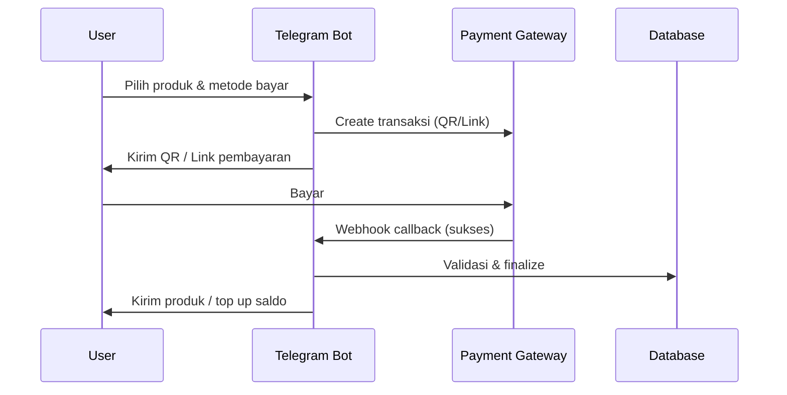


## 💳 Payment Gateway Supported

<div align="center">

| Gateway | Region | Tipe | Auto Detect | Logo/QR |
|:---:|:---:|:---:|:---:|:---:|
| **Pakasir** | 🇮🇩 Indonesia | QRIS | ✅ 3 detik | ✅ |
| **Qiospay** | 🇮🇩 Indonesia | QRIS Dynamic | ✅ 3 detik | ✅ |
| **Sanpay** | 🇮🇩 Indonesia | QRIS | ✅ 3 detik | ✅ |
| **Casaku** | 🇮🇩 Indonesia | QRIS Dynamic | ✅ 3 detik | ✅ |
| **Midtrans** | 🇮🇩 Indonesia | QRIS | ✅ 3 detik | ✅ |
| **Tripay** | 🇮🇩 Indonesia | QRIS | ✅ 5 detik | ✅ |
| **Violetpay** | 🇮🇩 Indonesia | QRIS | ✅ Auto | ✅ |
| **iPaymu** | 🇮🇩 Indonesia | QRIS (Redirect) | ✅ Callback | ✅ |
| **ToyyibPay** | 🇲🇾 Malaysia | FPX / DuitNow | ✅ Auto Detect | - |
| **Billplz** | 🇲🇾 Malaysia | FPX / e-wallet / DuitNow (di halaman bill) | ✅ Callback (`x_signature`) | - |
| **CHIP** | 🇲🇾 Malaysia | DuitNow QR | ✅ Callback | - |
| **GOPAY MERCHANT** | 🇮🇩 Indonesia | QRIS (Mutation) | ✅ Auto Detect | ✅ |
| **Orderkuota** | 🇮🇩 Indonesia | QRIS Dynamic (mutasi) | ✅ Polling + cek status | ✅ |
| **UPIExpress** | 🇮🇳 India | UPI (link + QR) | ✅ Webhook + cek status | - |
| **Cryptomus** | 🌍 Global | Kripto (USDT / multi-wallet) | ✅ Webhook + cek status | - |

> 💡 **Pro Tip:** Bisa aktifkan beberapa gateway sekaligus! Customer bebas pilih mau bayar lewat mana.  
> 🌏 **Malaysia Support:** ToyyibPay (FPX / DuitNow), Billplz (halaman bayar: FPX, e-wallet, DuitNow termasuk QR — bot kirim **link** bill), CHIP (DuitNow QR) — sama tersedia untuk **produk digital**, **top-up saldo**, dan **beli / perpanjang panel Pterodactyl** (sesuai gateway yang diaktifkan).  
> 🇮🇳 **India Support:** UPIExpress — set `BASE_CURRENCY=INR` di `.env`; checkout/top-up hanya gateway India.  
> 🪙 **Crypto:** Cryptomus — invoice USD; nominal IDR/MYR/INR dikonversi otomatis; butuh `PUBLIC_URL` HTTPS untuk webhook.

</div>

---

## 🖥️ Admin Panel Preview

<div align="center">

```
┌─────────────────────────────────────────────────────────────┐
│  📊 DASHBOARD                                               │
├─────────────────────────────────────────────────────────────┤
│                                                             │
│   💰 Pendapatan Hari Ini     📦 Transaksi      👥 Users    │
│   ┌─────────────────┐       ┌─────────┐      ┌─────────┐   │
│   │   Rp 2.450.000  │       │   145   │      │   892   │   │
│   │     ↑ 23%       │       │  ↑ 12%  │      │  ↑ 5%   │   │
│   └─────────────────┘       └─────────┘      └─────────┘   │
│                                                             │
│   📈 Grafik Penjualan 7 Hari Terakhir                      │
│   ═══════════════════════════════════                      │
│        ▄▄      ▄▄                                          │
│     ▄▄ ██ ▄▄  ██ ▄▄                                        │
│   ▄▄██ ██ ██ ▄██ ██ ▄▄                                     │
│   ████ ██ ██ ███ ██ ██ ▄▄                                  │
│   ────────────────────────                                 │
│   Sen Sel Rab Kam Jum Sab Min                              │
│                                                             │
└─────────────────────────────────────────────────────────────┘
```

**Fitur Admin Panel:**
- 📊 Dashboard statistik real-time + Growth Analytics
- 📦 Kelola produk, kategori, stok (drag-drop, bulk upload)
- 💳 Payment gateway management (15 gateway, hot reload)
- 🎫 Voucher management
- 🖥️ Panel package management (Pterodactyl)
- 📢 Broadcast ke semua user (filter, media, scheduled, poll)
- 🔔 Push notification ke browser (PWA-ready)
- 🔒 Security: 2FA (TOTP + Telegram OTP), audit log, CSRF, IP whitelist
- 🩺 **Instance Health** — MongoDB status, User Cache hit rate, Memory, Uptime per instance
- 💸 Transfer Saldo antar User (limit configurable)
- 📊 **BI Export** — Pretty / Flat / Time-series CSV untuk Power BI, Tableau, Sheets
- 🤝 Reseller API (H2H) management — API key, rate limit, audit
- 📱 Responsive — bisa dari HP!

</div>

---

## 📱 Bot Interface

<div align="center">

```
┌──────────────────────────────────┐
│  🤖 AUTO ORDER BOT               │
│  ════════════════════════════    │
│                                  │
│  Selamat datang, Jundy! 👋       │
│                                  │
│  ┌────────────────────────────┐  │
│  │  🎁 PROMO SPESIAL          │  │
│  └────────────────────────────┘  │
│                                  │
│  ┌──────────┐ ┌──────────────┐   │
│  │🛍️ Produk │ │💰 Cek Saldo  │  │
│  └──────────┘ └──────────────┘   │
│  ┌──────────┐ ┌──────────────┐   │
│  │📜 Riwayat│ │🖥️ Beli Panel │  │
│  └──────────┘ └──────────────┘   │
│  ┌──────────┐ ┌──────────────┐   │
│  │📱 PPOB   │ │⚙️ Pengaturan │  │
│  └──────────┘ └──────────────┘   │
│                                  │
│  🌐 ID | EN | MS                 │
│                                  │
└──────────────────────────────────┘
```

</div>

---

## 🎯 Cocok Untuk Jualan:

<div align="center">

| 🎮 Akun Premium | 📱 Pulsa & Kuota | 🖥️ Panel Hosting | 🎫 Voucher & License |
|:---:|:---:|:---:|:---:|
| Netflix | All Operator | Pterodactyl | Game |
| Spotify | Paket Data | VPS | Streaming |
| VPN | Token Listrik | Shared Host | Software |
| Game | E-Wallet | Dedicated | License Key |

</div>

---

## 📦 Fitur Lengkap

<details>
<summary><b>🛍️ Manajemen Produk</b></summary>

- Unlimited produk & kategori
- Bulk upload stok via file/teks
- Auto expired stock
- Sistem garansi fleksibel (7 hari - Full garansi)
- Stok otomatis berkurang setelah pembelian
- Required fields untuk produk custom (email, username, dll)
- Pagination produk per kategori
- Best seller produk
- Critical stock alert
- Retrieve stock (download sisa stok)

</details>

<details>
<summary><b>🎁 Promo & Voucher</b></summary>

- **Flash Sale / Promo Spesial** dengan countdown timer
- Voucher diskon (persentase atau nominal)
- Voucher redeem saldo / produk
- Maximum discount control
- Batas penggunaan per user
- Tanggal expired otomatis
- Analytics penggunaan voucher
- Channel notifications untuk promo

</details>

<details>
<summary><b>🖥️ Pterodactyl Integration</b></summary>

- Jualan panel hosting langsung dari bot
- Auto create user di Pterodactyl
- Auto create server dengan spec sesuai paket
- **Auto delete server expired** + notifikasi
- Warning H-3 dan H-1 sebelum expired
- Kelola paket panel dari admin web
- **Metode pembayaran panel** mengikuti gateway yang sama dengan checkout lain (QRIS Indonesia, ToyyibPay / Billplz / CHIP untuk Malaysia, dll.) — bukan hanya satu atau dua gateway tetap

</details>

<details>
<summary><b>💳 Payment System</b></summary>

- **12+ payment gateway** terintegrasi
- **Indonesia (QRIS):** Pakasir, Qiospay, Sanpay, Midtrans, Tripay, Violetpay, iPaymu, GoPay Merchant, Orderkuota
- **Malaysia:** ToyyibPay (FPX / DuitNow), **Billplz** (FPX / e-wallet / DuitNow di halaman Billplz), CHIP (DuitNow QR)
- Auto detect pembayaran < 3 detik
- **Anti Duplicate Payment** — Sistem Mutation ID tracking
- **Anti Double-Order Idempotency (3-layer)** — App cache `checkoutInProgress` + Transaction `refId` unique-index (SHA-1 deterministik: userId+productKey+messageId+timeBucket) + atomic `User.updateOne($inc, $gte)` deduct saldo dengan rollback otomatis. Klik berulang tombol bayar → `refId` identik → save kedua ditolak `code: 11000` → balas `processing_already`.
- Hot reload config (ganti setting tanpa restart)
- Custom logo di QRIS
- QRIS fee otomatis (configurable)
- Webhook callback dengan validasi signature (HMAC / x_signature / Bearer / IP whitelist)
- Saldo internal + top up via QRIS / FPX
- Retry & polling otomatis (orderkuota mutasi, dll.)

</details>

<details>
<summary><b>🌐 Multi-Language & Multi-Region</b></summary>

- **5 Bahasa bot:** Indonesia (`id`), English (`en`), Bahasa Melayu (`ms`), 中文 (`zh`), हिन्दी (`hi` — India, partial + fallback EN)
- **Indonesia (`IDR`):** QRIS gateway + **PPOB** (hanya jika DigiFlazz username & API key terisi)
- **Malaysia (`MYR`):** ToyyibPay, Billplz, CHIP — tanpa PPOB
- **India (`INR`):** UPIExpress — tanpa PPOB; fokus digital + panel Ptero
- Exchange rate support untuk user internasional
- Keyboard & pesan otomatis sesuai bahasa user
- **Localization MS** — Term **"warranty"** (bukan "garansi") untuk customer Malaysia agar lebih natural

**Currency support (Phase 1 USD aktif untuk display)**

| `BASE_CURRENCY` | Locale default | Simbol | Desimal | Status                                                     |
| --------------- | -------------- | ------ | ------- | ---------------------------------------------------------- |
| `MYR`           | `ms-MY`        | `RM`   | 2       | Production (gateway: ToyyibPay, Billplz, CHIP)             |
| `IDR`           | `id-ID`        | `Rp`   | 0       | Production (QRIS + PPOB opsional)                          |
| `INR`           | `en-IN` / `hi-IN` | `₹` | 2       | Production kode (UPIExpress); uji E2E disarankan           |
| `USD`           | `en-US`        | `$`    | 2       | **Phase 1**: display + config. Native gateway USD = Phase 3 (roadmap internal) |

</details>

<details>
<summary><b>🔗 Reseller API (H2H) — V2 Hardened</b></summary>

- **RESTful API V2** untuk reseller / Host-to-Host integrator
- **Endpoint:** order, cek status, cek saldo, list produk, callback
- **Authentication multi-layer:**
  - `X-Api-Key` per-reseller
  - `X-Signature` HMAC-SHA256 dari body + timestamp + nonce
  - `X-Nonce` replay-guard (Mongo TTL collection)
  - `Idempotency-Key` untuk safe retry — replay yang sama → response cache; key sama + body beda → `409 conflict`
- **Rate limiting** per-reseller (configurable di admin)
- **Audit log** tiap request (signature pass/fail, body hash, response code)
- **Atomic order processing** — anti partial-state (saldo deduct + stok claim + tx save dalam satu transaction)
- **Envelope error standar** RFC 7807-style
- Dokumentasi lengkap:
  - Spesifikasi lengkap & QA checklist H2H V2 tersedia **on-request** untuk integrator aktif (hubungi owner)
- Cocok untuk supplier yang buka reseller / agregator

</details>

<details>
<summary><b>🩺 Instance Health & Performance Monitoring</b></summary>

- **Endpoint `GET /admin/health`** — JSON status: MongoDB connection, `userCache` (hits / misses / hitRate / TTL / size / evictions), `memory` (rss / heapUsed / heapTotal / external), `uptimeSeconds`, `pid`, `node`. HTTP `503` kalau MongoDB tidak `connected`. Diproteksi `monitorAuth`.
- **UI Dashboard Monitor** — Section `Instance Health` di `/monitor`:
  - 4 stat card (MongoDB pill, Cache Hit Rate %, Heap Used, Uptime)
  - 3 panel detail: User Cache (progress bar hit rate, size, TTL), Memory (progress bar heap), Instance info (PID, Node, Endpoint, Last update)
  - Auto-refresh 10 detik + tombol refresh manual
  - Mobile menu: quick stat MongoDB + Cache Hit Rate %
- **Multi-tenant aware** — Tiap instance bot punya cache & memori sendiri → cocok untuk monitor terpisah per `BOT_USERNAME`.
- **Performance optimization** — User cache LRU + TTL (reduce MongoDB round-trip), fire-and-forget username update, auto-migration index saat startup.

</details>

<details>
<summary><b>💸 Transfer Saldo antar User</b></summary>

- User bisa kirim saldo ke sesama user via username Telegram
- **Atomic transfer** (`User.updateOne` dengan `$inc` + `$gte` guard) — anti partial transfer
- **Audit-log** di MongoDB (siapa kirim, siapa terima, jumlah, timestamp, refId)
- **Limit configurable** di admin (per-transaksi, per-hari, total)
- **Anti double-transfer** idempotency layer
- Channel notification opsional untuk transfer
- Detail teknis tersedia on-request untuk reseller / integrator.

</details>

<details>
<summary><b>📝 Manual Order System</b></summary>

- Produk yang butuh **data tambahan** dari user (username, email, server ID, nomor HP, dll.) — bot prompt input sesuai field config produk
- Setelah user kirim semua data → notifikasi otomatis ke **admin channel** dengan ringkasan lengkap (user, produk, data, total, ref ID)
- Admin proses dari **Dashboard Pending Orders** — tombol Selesai / Tolak / Refund dalam 1 klik
- **Refund otomatis** kalau admin tolak (saldo dikembalikan + audit log)
- Cocok untuk: top-up game by-ID, jasa custom, voucher butuh email, dll.

</details>

<details>
<summary><b>📱 PPOB Multi-Provider — 🚧 Beta / In Development</b></summary>

> ⚠️ **Catatan**: PPOB (Payment Point Online Bank) **belum production-ready / belum di-release**. Adapter & skeleton sudah dibuat tapi masih tahap hardening & QA. **Hanya tenant `BASE_CURRENCY=IDR`** dan **hanya jika** `PPOB_DIGIFLAZZ_USERNAME` + `PPOB_DIGIFLAZZ_API_KEY` terisi — kalau belum, menu PPOB **tidak tampil**. Tenant MYR/INR/USD tidak menampilkan PPOB.

**Yang sudah ada (skeleton/beta):**
- Multi-provider architecture (DigiFlazz, OkeConnect, SanPay, QiosPay) dengan interface unified — bisa switch provider tanpa ubah business logic
- Adapter DigiFlazz: client, signer (MD5), mapper status, transaction, status check, webhook callback
- Catalog sync (manual via admin `POST /admin/products/ppob/sync` + scheduled)
- Model `Product` punya field `ppobProvider`, `ppobProviderSku`, `ppobLastSyncedAt` (partial unique index untuk produk PPOB asli — non-PPOB tidak ikut)
- Webhook callback security (HMAC secret) + auto-refund saldo kalau status provider `FAILED`/`EXPIRED`
- Admin UX: dropdown pilih provider, tombol "Sync PPOB Now", badge "Last sync", endpoint monitoring

**Yang masih dalam pengembangan / belum siap release:**
- End-to-end hardening flow callback produksi
- QA penuh skenario multi-provider failover
- UI bot menu PPOB user-facing
- Reconciliation report (selisih provider vs internal)
- Pricing & margin auto-update dari provider

**Dokumentasi (untuk developer/early access):**
- Dokumentasi PPOB internal (arsitektur multi-provider, rencana implementasi DigiFlazz, roadmap fitur, user journey, code review checklist) **tersedia on-request** untuk early-access / beta tester.

</details>

<details>
<summary><b>🔒 Security</b></summary>

- **Two-Factor Authentication (2FA)** — TOTP (Google Authenticator) + Telegram OTP
- **Role-Based Access Control (RBAC)** — Owner / Admin / Staff dengan menu visibility per-role
- **CSRF Protection** — Token per session, double-submit cookie
- **Rate Limiting** — Per IP, per endpoint, per admin
- **Security Audit Log** — Tiap aksi sensitif (login, gateway change, broadcast, refund) tercatat
- **Encrypted Sensitive Data** — Encryption-at-rest untuk API key gateway, password admin (bcrypt)
- **IP Whitelist** untuk callback webhook
- **Anti-Spam Bot** — Rate limit per-user, ban/unban, auto-detect bot/scraper (konfig & threshold internal — disetting per-deploy)
- **Reset Password** flow dengan email + token expiry

</details>

<details>
<summary><b>📊 Analytics & Report — BI-Ready</b></summary>

- Dashboard statistik real-time
- **Growth Analytics**:
  - Funnel konversi (created → success / failed / pending)
  - Period summary (revenue, ARPU, paying buyer, transaction count)
  - Repeat purchase rate + revenue normalized ke `BASE_CURRENCY`
  - LTV per cohort
  - Cohort analysis (heatmap)
- Grafik penjualan harian/mingguan/bulanan
- Top produk terlaris
- User paling aktif (today & all-time)
- **Export CSV 3-mode (untuk BI tools)**:
  - **`pretty`** (default) — Blok bertitel (META / FUNNEL / PERIODE / REPEAT / LTV / COHORT / NOTE) dengan header `Metrik` / `Nilai`. Cocok untuk Excel viewer manusia.
  - **`flat`** — Single-sheet datar 9 kolom konsisten (`section, metric, dimension, value, unit, period, filter_start, filter_end, base_currency`). Cocok untuk **Power BI / Tableau / Sheets** — pivot/filter langsung tanpa post-processing.
  - **`timeseries`** — Long-format 9 kolom dengan `date` (`YYYY-MM-DD`) + granularitas `day` / `week`. 10 metrik per bucket waktu (`revenue_success`, `paying_buyers`, `arpu`, `tx_created`, `tx_success`, `tx_failed`, `tx_pending`, `conversion_pct`, `new_buyers`, `topup_revenue`). **Untuk chart tren** di Power BI.
- **Export Laporan Overview** juga dual-mode (`csv` pretty + `flat` 14-kolom RFC 4180)
- Endpoint preview: `GET /admin/analytics/timeseries.json?granularity=day|week`
- Push notification ke browser (PWA-ready) untuk transaksi sukses, low-stock alert, dll.

</details>

<details>
<summary><b>📄 Invoice & Notifikasi</b></summary>

- **Invoice generation** (Canvas-based PNG) — auto-render saat transaksi sukses
- Custom logo & banner invoice
- Large product delivery (`.txt` attachment kalau payload panjang)
- **Channel notifications** (pembelian, top-up, voucher claim, manual order, refund, stock broadcast)
- Invoice image ke channel
- Custom sticker / GIF notifikasi
- Custom welcome sticker `/start`
- Custom gambar `/start`
- **Markdown-safe** — semua dinamis content auto-escape (anti `can't parse entities` error)
- **Telegram retry & fallback** — kalau channel kirim gagal (mis. `chat not found`), bot lanjut jalan tanpa crash

</details>

<details>
<summary><b>⚙️ Fitur Tambahan</b></summary>

- Full warranty / garansi langganan
- Manual confirmation transaksi
- Order admin tanpa pay (sebagai owner)
- Support ticket system (CS handoff ke staff manual)
- Ban/unban user + banned list
- Broadcast message (filter user/region/lang, media support, scheduled, poll campaign)
- Cancel transaksi oleh user
- Cek status transaksi real-time
- **Banner dinamis** di main menu (rotating, scheduled)
- **Stock broadcast** otomatis saat restock
- **Best seller** auto-rank dari data transaksi
- **Critical stock alert** ke admin channel
- **Auto Recap** — ringkasan penjualan harian/mingguan/bulanan otomatis ke admin & channel (revenue, growth %, top produk, stok menipis)

</details>

---

## 🔬 Engineering Deep-Dive

Bagian ini untuk **developer / buyer teknis / reseller H2H** yang mau lihat cara kerja dalemannya. Semua diagram di bawah ini merefleksikan kode di repo (`services/transactionFinalize.js`, `routes/resellerApi.js`, `routes/webhooks.js`, `services/userCache.js`, dll.).

### 🏢 Multi-Tenant Architecture

Satu source code bisa dijalankan jadi **banyak instance bot sekaligus** — beda `BOT_TOKEN`, beda `DB_NAME`, beda port. Tiap instance punya cache + heap sendiri, tidak saling rebutan.

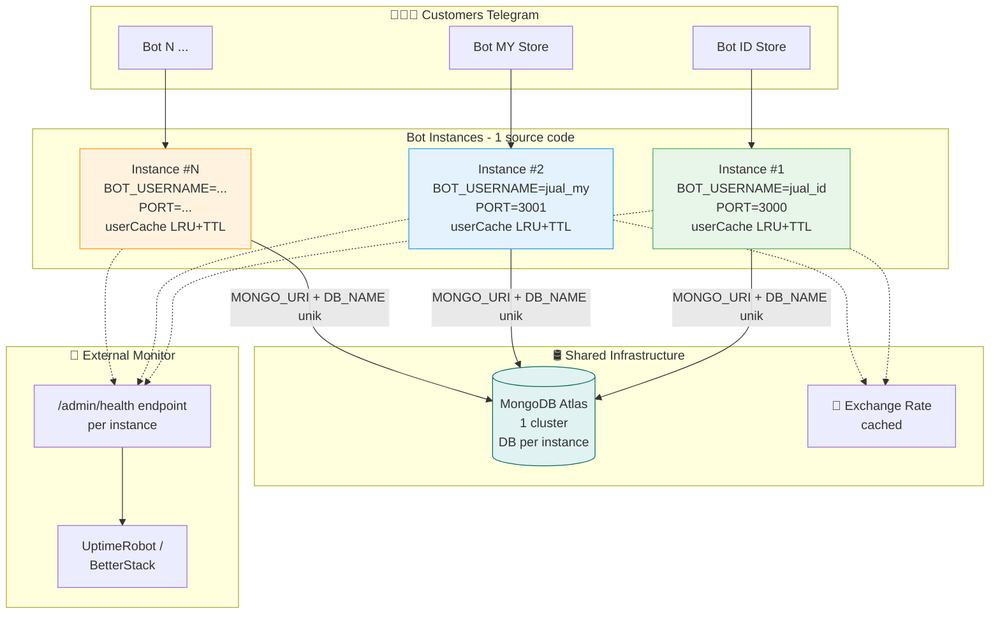

**Yang menjamin instance tidak saling konflik:**

- `userCache` LRU + TTL **per-process** → tidak ada shared mutable state antar instance
- `DB_NAME` unik per `.env` → koleksi terisolasi
- `refId` deterministik tetap unique-per-DB (bukan global), aman buat multi-tenant
- Auto-migration index hanya jalan di startup tiap instance → tidak conflict

> 📚 Detail performance & cache hit rate: lihat section [**Performance Benchmarks**](#-performance-benchmarks) dan endpoint `GET /admin/health`.

---

### 🛤️ User Journey End-to-End

Apa yang user lihat dari `/start` sampai produk terkirim:

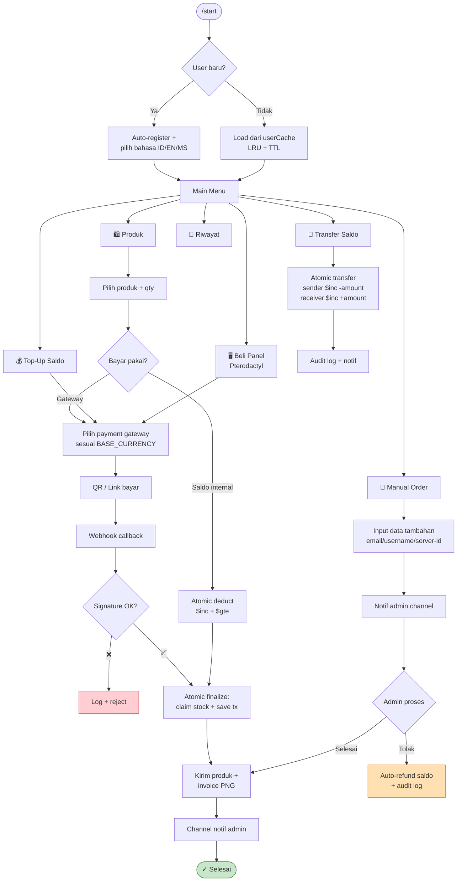

---

### 🚦 State Machine Transaksi

State machine yang dipakai `Transaction.status` di `services/transactionFinalize.js`:

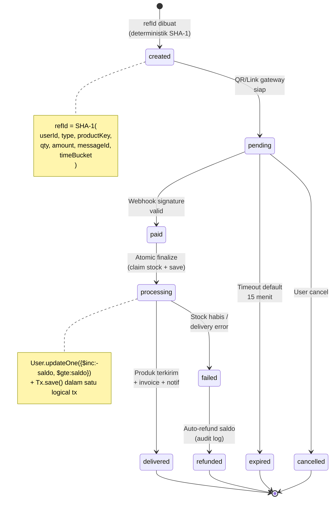

> 📚 State diagram lengkap (termasuk refund partial & manual order): [`docs/STATE_MACHINE.md`](docs/STATE_MACHINE.md).

---

### 🛡️ 3-Layer Anti Double-Order Idempotency

Skenario: user **panik klik tombol "Bayar Sekarang" 5x dalam 2 detik** (atau race-condition dari multiple devices). Bot **tidak pernah** double-debit / double-deliver. Pertahanan berlapis:

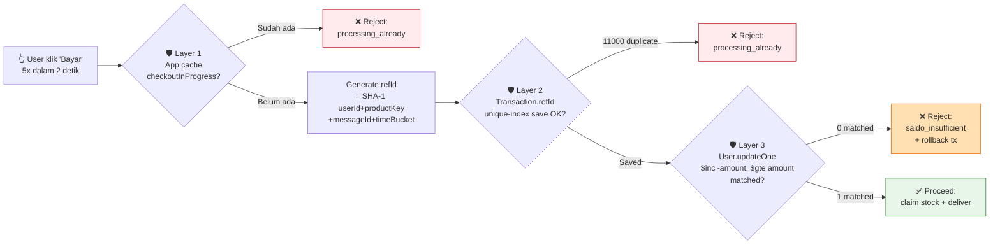

| Layer | Lokasi | Mekanisme | Apa yang dijaga |
|:---|:---|:---|:---|
| **L1 App Cache** | `Map` in-process | Set flag `checkoutInProgress` per `userId+productKey`, auto-expire setelah ms tertentu | Klik super cepat sebelum DB ke-hit |
| **L2 DB Unique Index** | `Transaction.refId` | `refId` deterministik (SHA-1) + `unique: true` index | Race condition multi-process / multi-instance |
| **L3 Atomic Balance** | `User.updateOne` | `{ $inc: { saldo: -amount } }` + `{ saldo: { $gte: amount } }` filter | Saldo minus + over-deduct + concurrent withdraw |

> Implementasi: `services/transactionFinalize.js`, `services/transactionHelpers.js`, `models/Transaction.js`.

---

### 🌐 Webhook Callback Pipeline

Tiap payment gateway punya format callback berbeda, tapi semua melalui pipeline standar:

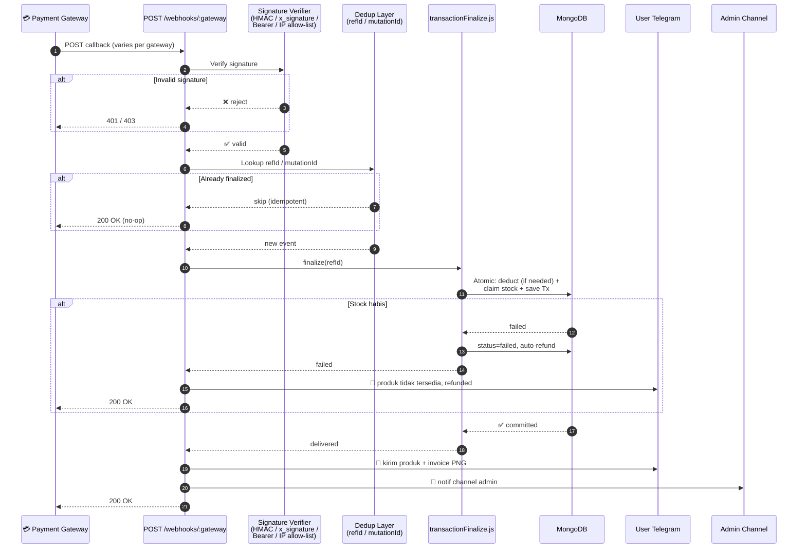

**Gateway yang aktif** mengikuti urutan di admin (`payment_gateway_order`) dan filter `BASE_CURRENCY`:

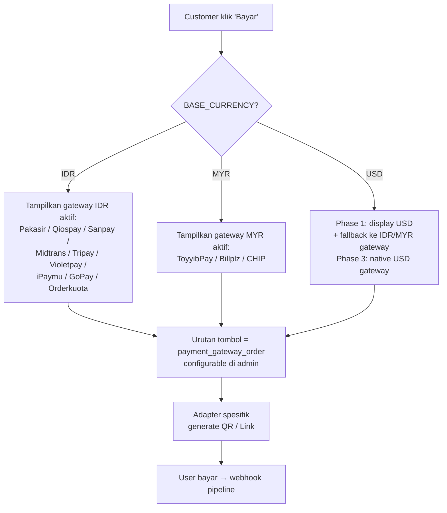

---

### 🤝 Reseller H2H Request Lifecycle

Endpoint `/api/v2/order` di [`routes/resellerApi.js`](routes/resellerApi.js) dengan hardening signature + nonce + idempotency:

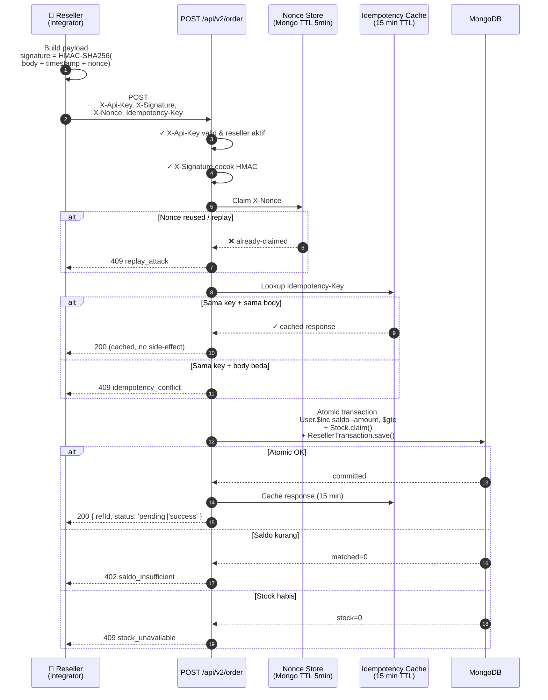

> 📚 Spesifikasi lengkap H2H V2 (request/response schema, error codes, retry semantics, QA checklist integrator) tersedia **on-request** untuk reseller aktif — hubungi owner.

---

### 🗃️ Data Model (ER Diagram)

Skema MongoDB (Mongoose) utama — disederhanakan, lihat folder [`models/`](models/) untuk versi lengkap (16+ schema):

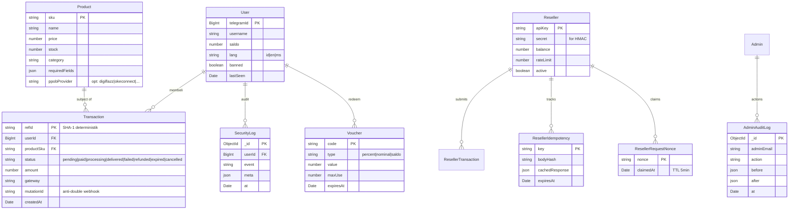

> 📚 Skema lengkap & relasi semua model: [`docs/DATA_MODEL.md`](docs/DATA_MODEL.md).

---

## 📈 Performance Benchmarks

Diukur di **baseline lab**: VPS 2 vCPU / 2 GB RAM, MongoDB Atlas M0 (free tier), Node.js 20 LTS, 1 instance bot, network normal (~50 ms RTT ke MongoDB). Angka di production realistis akan **lebih cepat** di RAM/CPU lebih besar, atau **lebih lambat** di MongoDB cluster yang sudah penuh.

| Metric | Target | Baseline Observed | Catatan |
|:---|:---:|:---:|:---|
| **Deteksi pembayaran (webhook → user)** | <3 s | ~1.5–2.5 s | Sebagian besar latency dari verifikasi signature gateway + delivery Telegram |
| **Order → invoice terkirim** | <5 s | ~3–4 s | Termasuk render invoice Canvas PNG ~300–700 ms |
| **User cache hit rate** (steady state) | >80% | ~85–95% | LRU + TTL — lihat `GET /admin/health` |
| **MongoDB round-trip per `/start`** | 0–1 | 0 (cache hit) / 1 (cache miss) | Fire-and-forget update untuk username/last_seen |
| **Concurrent users tertangani / instance** | ≥500 | ~700–1000 (steady) | Tergantung berat handler & MongoDB cluster |
| **Reseller H2H p95 latency** | <800 ms | ~400–600 ms | Atomic Mongo + verifikasi signature |
| **Memory heap idle (1 instance)** | <200 MB | ~120–160 MB | Naik saat broadcast besar — auto-GC normal |
| **Webhook idempotency reject** | 100% | 100% | 3-layer guard belum pernah gagal di test |

> ⚠️ **Disclaimer**: angka di tabel adalah **observasi tipikal**, bukan garansi SLA. Skala produksi & spec server akan menggeser angka. Untuk uptime monitor production, hubungkan endpoint `GET /admin/health` ke UptimeRobot / BetterStack.

**Cara verifikasi sendiri:**

```bash
# Health check + cache hit rate live
curl -H "Authorization: Bearer $MONITOR_TOKEN" \
  https://your-bot.example.com/admin/health | jq

# Output:
# {
#   "mongo": "connected",
#   "userCache": { "hits": 12480, "misses": 312, "hitRate": "97.6%", ... },
#   "memory": { "heapUsed": "142 MB", ... },
#   "uptimeSeconds": 86412
# }
```

---

## 🗺️ Roadmap

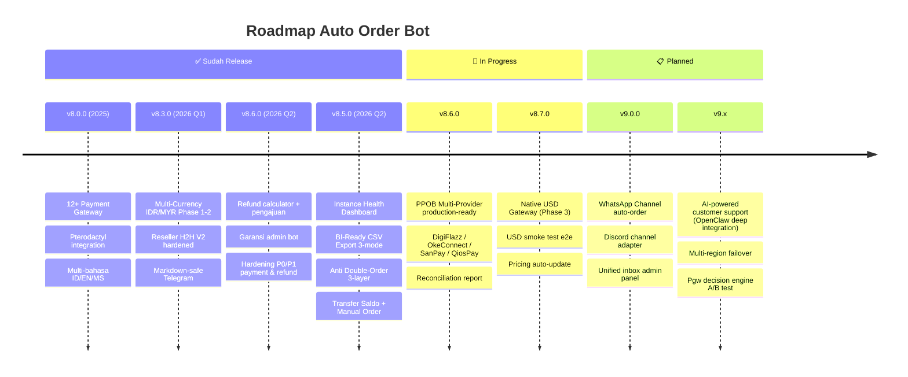

| Status | Versi | Highlight |
|:---:|:---|:---|
| ✅ | **v8.6.0** | Refund calculator + request, garansi admin, hardening refund/payment |
| ✅ | **v8.5.0** | Health dashboard, BI export, 3-layer idempotency, transfer saldo, manual order |
| 🚧 | **v8.6.0** | PPOB go-live (DigiFlazz + OkeConnect + SanPay + QiosPay) |
| 🚧 | **v8.7.0** | Native USD gateway (Phase 3) + reconciliation report |
| 📋 | **v9.0.0** | WhatsApp + Discord auto-order |
| 📋 | **v9.x** | AI customer support, multi-region failover |

> Roadmap dapat berubah sesuai prioritas customer & ekosistem. Update terbaru selalu di [`CHANGELOG.md`](CHANGELOG.md).

---

## 📁 Folder Structure

```
auto-order-bot/
├─ bot.js                          # Entry: Telegram + Express + Socket.io
├─ bot/                            # Telegraf bot logic
│  ├─ keyboards/                   # Reply keyboards (main menu, dll.)
│  ├─ messages/                    # Message templates (i18n-aware)
│  ├─ middlewares/                 # Telegram middlewares (auth, throttle, audit)
│  └─ stateHelpers.js              # Conversation state machine
│
├─ features/                       # Feature flows (user-facing)
│  ├─ user/                        # /produk, /saldo, /topup, /transfer, /history
│  ├─ admin/                       # Broadcast, manual order, settings
│  ├─ checkout/                    # Checkout pipeline + payment message
│  └─ integrations/                # Pterodactyl, dll.
│
├─ services/                       # Business logic core
│  ├─ payment/                     # 12+ gateway adapters (pakasir, billplz, dll.)
│  │  ├─ INTERFACE.md              # Contract adapter baru
│  │  └─ <gateway>.js              # Adapter masing-masing
│  ├─ ppob/ 🚧                     # PPOB multi-provider (beta)
│  │  ├─ core/                     # interfaces, statusMapper, syncScheduler
│  │  └─ providers/                # digiflazz, okeconnect, sanpay, qiospay
│  ├─ cs/                          # OpenClaw CS handoff
│  ├─ transactionFinalize.js       # ⭐ Idempotent finalize (3-layer guard)
│  ├─ transactionHelpers.js        # refId deterministik + helpers
│  ├─ balanceTransfer.js           # Atomic transfer saldo
│  ├─ userCache.js                 # LRU + TTL cache user
│  └─ adminAnalytics.js            # Growth analytics + CSV 3-mode export
│
├─ models/                         # Mongoose schemas (16+)
│  ├─ User.js, Transaction.js, Product.js
│  ├─ Voucher.js, Reseller.js
│  ├─ ResellerIdempotency.js, ResellerRequestNonce.js
│  └─ SecurityLog.js, AdminAuditLog.js, dll.
│
├─ routes/                         # Express routes
│  ├─ admin/                       # Admin panel API (auth-protected)
│  │  ├─ analytics.js, products.js, gateways.js
│  │  └─ security.js, broadcast.js, users.js
│  ├─ resellerApi.js               # ⭐ H2H V2 (signature + nonce + idempotency)
│  └─ webhooks.js                  # Gateway callbacks (HMAC verified)
│
├─ public/                         # Admin panel UI (HTML/JS/CSS)
│  ├─ admin.html, admin-products.html
│  ├─ monitor.html                 # Real-time monitor + Instance Health
│  └─ js/, css/
│
├─ server/                         # Bootstrap & lifecycle
│  ├─ botLifecycle.js, httpServer.js, shutdownHandler.js
│
├─ monitor/                        # Real-time monitor service (Socket.io)
├─ config/                         # Payment gateways config catalog
├─ utils/                          # Constants, role helpers, dll.
├─ docs/                           # 📚 Public technical docs (PRD, arsitektur, state machine, dll. — lihat docs/INDEX.md)
├─ tests/                          # Jest unit + smoke tests
│  ├─ broadcast/, cs/, payment/
│  ├─ smoke/                       # Checkout, webhook signature
│  └─ transaction/                 # refId, claim stock, finalize, getCheckAmount
└─ assets/                         # Logo, icons, banner (di-track di git)
```

> Lihat juga: [`docs/RUNTIME_MAP.md`](docs/RUNTIME_MAP.md) untuk peta runtime per file → fungsi → tanggung jawab.

---

## 🛠️ Tech Stack

<div align="center">


</div>

---

## 📋 Requirements

| Kebutuhan | Keterangan | Biaya |
|:---|:---|:---:|
| VPS / Panel | Minimal 2GB RAM, Node.js 18+ (LTS) | ~50rb/bulan (OPSIONAL)|
| MongoDB | MongoDB Atlas (cloud) | **GRATIS** |
| Bot Token | Dari @BotFather Telegram | **GRATIS** |
| Payment Gateway | Pilih salah satu atau lebih | Varies |

---

## ❓ FAQ

<details>
<summary><b>Apakah harus punya VPS?</b></summary>

Ya, bot perlu jalan 24/7. Minimal VPS 1GB RAM (~50rb/bulan) atau panel hosting yang support Node.js. Bisa juga pakai Railway, Render, atau VPS gratis (dengan batasan).
</details>

<details>
<summary><b>Bisa pakai hosting shared?</b></summary>

Tergantung. Hosting shared biasanya tidak allow long-running process. Lebih cocok pakai VPS, cloud (MongoDB Atlas gratis), atau panel yang support Node.js.
</details>

<details>
<summary><b>Bagaimana cara ganti payment gateway?</b></summary>

Lewat Admin Panel → Payment Gateway. Isi API key & config, lalu aktifkan. Bisa aktifkan beberapa gateway sekaligus — customer pilih sendiri. **Hot reload** = tidak perlu restart bot.
</details>

<details>
<summary><b>Support Pterodactyl versi berapa?</b></summary>

Kompatibel dengan Pterodactyl Panel 1.x. Untuk setup detail, lihat `docs/ARCHITECTURE.md` atau dokumentasi instalasi.
</details>

<details>
<summary><b>Apakah bisa jualan tanpa Pterodactyl?</b></summary>

Bisa! Pterodactyl hanya untuk yang jual hosting/panel. Untuk produk digital (akun, voucher, license key), tidak perlu Pterodactyl.
</details>

<details>
<summary><b>Customer Malaysia bisa bayar?</b></summary>

Ya! Untuk Malaysia: ToyyibPay (FPX / DuitNow), Billplz (link ke halaman bayar — biasanya FPX, e-wallet, DuitNow/QR), dan CHIP (DuitNow QR) — bisa dipakai untuk checkout produk, top-up saldo, dan panel Pterodactyl (yang diaktifkan). Bot juga support multi-bahasa (Melayu) dengan term lokal seperti "warranty" (bukan "garansi") supaya lebih natural.
</details>

<details>
<summary><b>Apakah bot ini siap multi-tenant (banyak bot 1 source code)?</b></summary>

Ya. Banyak user yang jalanin **5–20 instance bot sekaligus** dari source code yang sama, hanya beda `.env` (token, MongoDB DB, port). Tiap instance punya cache `userCache` (LRU + TTL) sendiri → tidak saling konflik. Untuk monitoring tiap instance, pakai endpoint `GET /admin/health` (JSON status MongoDB, cache hit rate, memory, uptime) atau lihat dashboard di `/monitor` → section **Instance Health**.
</details>

<details>
<summary><b>Bagaimana cara mencegah dobel order kalau user klik tombol bayar berkali-kali?</b></summary>

Sudah ada **3-layer idempotency**:
1. **App cache** `checkoutInProgress` per `userId+productKey` (in-memory, expire cepat)
2. **Database unique index** pada `Transaction.refId` (deterministik dari `SHA-1(userId,type,productKey,qty,amount,messageId,timeBucket)`)
3. **Atomic balance deduct** `User.updateOne($inc, $gte: amount)` — kalau saldo kurang, deduct gagal & order otomatis dibatalkan

Klik berulang → `refId` identik → save kedua ditolak `code: 11000` → bot balas "transaksi sedang diproses" → **tidak akan dobel debit / dobel kirim**.
</details>

<details>
<summary><b>Apakah PPOB (pulsa, paket data, PLN, dll.) sudah jalan?</b></summary>

🚧 **Belum.** Adapter PPOB multi-provider (DigiFlazz, OkeConnect, SanPay, QiosPay) sudah disiapkan secara struktur, tapi **masih dalam pengembangan & belum siap release**. Saat ini bot fokus ke produk digital (akun, voucher, license key, panel hosting). Roadmap & checklist go-live tersedia on-request untuk early access.
</details>

<details>
<summary><b>Export laporan untuk Power BI / Tableau ada gak?</b></summary>

Ada — **3 mode** untuk export Growth Analytics:
- `?format=pretty` — Excel viewer manusia (blok bertitel)
- `?format=flat` — Power BI / Tableau / Sheets (single-sheet 9 kolom)
- `?format=timeseries` — chart tren waktu (day/week granularity, 10 metrik per bucket)

Export Laporan Overview juga punya `?format=flat` (14 kolom RFC 4180). Semua via tombol di Dashboard.
</details>

<details>
<summary><b>Reseller H2H aman dari replay attack & race condition?</b></summary>

Ya. Semua endpoint H2H V2 wajib `X-Api-Key` + `X-Signature` (HMAC-SHA256) + `X-Nonce` (replay-guard via Mongo TTL collection) + `Idempotency-Key`. Order processing atomic (saldo deduct + stok claim + tx save dalam 1 transaction). Audit log tiap request. Spesifikasi lengkap tersedia **on-request** untuk reseller aktif.
</details>

---

## 🧭 Dokumentasi Teknis (Developer)

Dokumen public untuk memahami arsitektur, alur data, dan operasional bot. Mulai dari [`docs/INDEX.md`](docs/INDEX.md) untuk navigasi cepat.

| Prioritas | File | Isi |
|-----------|------|-----|
| 1 | [`docs/PRD.md`](docs/PRD.md) | Product Requirement — scope, persona pengguna, fitur utama |
| 2 | [`docs/ARCHITECTURE.md`](docs/ARCHITECTURE.md) | Arsitektur & alur order → payment → finalize → delivery |
| 3 | [`docs/RUNTIME_MAP.md`](docs/RUNTIME_MAP.md) | Peta runtime: startup → checkout → webhook / polling → finalize |
| 4 | [`docs/DATA_MODEL.md`](docs/DATA_MODEL.md) | Skema MongoDB / Mongoose (User, Product, Transaction, dll.) |
| 5 | [`docs/STATE_MACHINE.md`](docs/STATE_MACHINE.md) | State machine transaksi (`pending` → `paid` → `delivered` / `refunded` / `expired`) |
| 6 | [`docs/FLOWCHART.md`](docs/FLOWCHART.md) | Flowchart visual end-to-end (Mermaid) — checkout, refund, webhook |
| 7 | [`docs/RUNBOOK.md`](docs/RUNBOOK.md) | Setup env, menjalankan bot, troubleshooting operasional |
| 8 | [`CHANGELOG.md`](CHANGELOG.md) | Riwayat perubahan per versi |
| 9 | [`docs/PROGRESS.md`](docs/PROGRESS.md) | Status fitur per pasar (ID/MY/IN), gateway, i18n — **update rutin** |
| — | [`task.md`](task.md) | Task IN PROGRESS / TODO / DONE untuk dev & AI assistant |

## 📋 Task & Progress (Developer)

Agar status repo **selalu terlacak**, gunakan dua file ini (perbarui setiap sesi kerja besar):

| File | Isi |
|------|-----|
| **[`task.md`](task.md)** | Backlog operasional: **IN PROGRESS**, **TODO**, **DONE** + versi bot |
| **[`docs/PROGRESS.md`](docs/PROGRESS.md)** | Matriks pasar, gateway, bahasa, file kunci — referensi cepat |

Workflow Cursor: baca `task.md` dulu → selesaikan → pindahkan ke DONE → sinkronkan `docs/PROGRESS.md` + bullet **Terbaru** di README ini.

> 🔒 **Dokumen internal yang tidak dipublish di repo public**: roadmap fitur masa depan (WhatsApp / Discord, PPOB native, USD native), business plan & vendor-specific integration plan (CHIP, Sanpay, Qrispy), mitigasi keamanan owner, konfigurasi anti-spam, internal refactor roadmap, RBAC detail, QA milestone checklist, dll.
>
> Buyer aktif & integrator H2H yang butuh akses dokumen internal (mis. **spesifikasi Reseller H2H API V2 lengkap**, anti-spam config, RBAC plan) silakan hubungi owner via kontak di [Hubungi Saya](#-hubungi-saya).

### 🤖 Konteks untuk AI Assistant

Project ini punya **persistent memory file** untuk AI assistant (Cursor / Copilot / Claude / dll.) supaya tidak perlu re-explain dari nol setiap chat baru:

| File | Tujuan |
|------|--------|
| **[`task.md`](task.md)** | Task aktif & riwayat DONE — **baca pertama** setiap sesi |
| **[`docs/PROGRESS.md`](docs/PROGRESS.md)** | Status fitur per region & kelengkapan i18n |
| **[`AGENTS.md`](AGENTS.md)** | Quick rules — bahasa, coding style, workflow, security defaults, common patterns |
| **[`docs/PROJECT_CONTEXT.md`](docs/PROJECT_CONTEXT.md)** | Konteks lengkap — tech stack, target user, deployment constraint, decisions history, plan documents, active TODOs |

AI tool yang masuk repo ini disarankan **baca dua file di atas dulu** sebelum coding apa pun. Update kedua file kalau ada decision major atau architecture change.

## ▶️ Cara Menjalankan (Developer)

1. Buat file **`.env` lokal** (tidak ada di repo publik). Panduan variabel: [`docs/RUNBOOK.md`](docs/RUNBOOK.md). Template lengkap `.env.example` hanya dari **owner / paket privat**.
   - **Bot & DB**: `BOT_TOKEN`, `MONGO_URI`, `ADMIN_IDS`, `CHANNEL_ID`
   - **Payment umum**: `BASE_CURRENCY` (`IDR` / `MYR` / `INR` / `USD`), `CURRENCY_LOCALE`, `PUBLIC_URL`
   - **Gateway per-provider**: sesuai negara (QRIS, ToyyibPay, UPIExpress, dll.)
   - **Admin panel**: session secret & monitor login (lihat RUNBOOK)
2. Install dependency:

```bash
npm install
```

3. Jalankan bot:

```bash
npm run start
# atau dev mode dengan auto-reload
npm run dev
```

4. Akses admin panel: `http://localhost:3000/admin` (default port `3000`).
5. **Multi-instance / multi-tenant** — Buat folder per bot dengan `.env` masing-masing, atau pakai script `restart-bot.bat` (Windows) untuk restart cepat tanpa kill port lain.

### 🩺 Health check & monitoring

- `GET /admin/health` — JSON status MongoDB / cache / memory / uptime (untuk uptime monitor eksternal seperti UptimeRobot, BetterStack)
- `/monitor` → section **Instance Health** untuk dashboard visual real-time

## 🔐 Catatan Keamanan

- **Jangan pernah** meng-commit `.env` atau `.env.example` ke repo publik (token, API key, URI, ID admin). Template env dibagikan **privat** ke buyer.
- Pastikan file `storage/.encryption_key` dan `storage/.encryption_iv` **tidak ikut commit** (sudah di-`.gitignore`).
- Endpoint webhook harus selalu **memverifikasi signature** (HMAC / x_signature / Bearer / IP whitelist) untuk provider yang mendukung.
- Jika menambah fitur payment/delivery baru, pastikan flow finalisasi tetap **idempotent** (anti dobel-kirim/dobel-success) — pakai pattern `refId` deterministik + unique index seperti existing code.
- Untuk Reseller H2H integrator, **selalu** validasi `X-Signature`, `X-Nonce` (replay-guard), dan `Idempotency-Key`. Spesifikasi lengkap on-request.
- Aktifkan **2FA admin** (TOTP / Telegram OTP) untuk akun owner & admin di production.

<div align="center">

# 💎 ORDER SEKARANG

### Pilih Paket yang Cocok Buat Kamu

</div>

---

## 🛒 Paket Harga

<div align="center">

| | 🚀 INSTALASI | 🔄 PERPANJANGAN | 💎 BELI SC | ⚡ CUSTOM |
|:---|:---:|:---:|:---:|:---:|
| **Harga** | **Rp 40.000** | **Rp 25.000**/bulan | **Rp 2.675.000** | Nego |
| Keterangan | Bulan pertama | Bulan ke-2 dst | Lifetime | Request |
| Source Code | ❌ | ❌ | ✅ Full akses | ✅ |
| Free Update | ✅ | ✅ | ❌ | ❌ |
| Support | ✅ Full | ✅ Full | ✅ Full | ✅ Priority |
| Custom Fitur | ❌ | ❌ | 1x Gratis | Unlimited |

> 💡 **Instalasi Rp 40.000** sudah termasuk setup lengkap + 1 bulan pertama!  
> 🔄 **Perpanjangan hanya Rp 25.000/bulan** - Lebih hemat!

</div>

### ✅ Semua Paket Dapat:

- ✓ Bot fully functional & tested
- ✓ Admin panel lengkap (responsive)
- ✓ 12+ payment gateway siap pakai
- ✓ Multi-bahasa (ID/EN/MS)
- ✓ Panduan instalasi detail
- ✓ Bantuan setup awal
- ✓ Support via Telegram
- ✓ Akses grup diskusi

### 🎁 Bonus Pembelian:

- 🔥 Template produk siap pakai
- 📚 Group WhatsApp tutorial instalasi
- 💡 Tips & trick jualan online
- 🤝 Konsultasi bisnis digital

---

## 📞 Hubungi Saya

<div align="center">

[](https://t.me/TempestVPNOfficial)
[](https://wa.me/6283111380628)

**⏰ Fast Response: 09:00 - 22:00 WIB**

---

### 🌟 Testimoni

> *"Bot nya keren, pembayaran langsung kedeteksi. Jualan jadi autopilot!"*  
> — **@user1** ⭐⭐⭐⭐⭐

> *"Admin panelnya lengkap banget, gampang dipake."*  
> — **@user2** ⭐⭐⭐⭐⭐

> *"Support nya fast respon, recommended!"*  
> — **@user3** ⭐⭐⭐⭐⭐

---

### 📈 Statistik

| 👥 User Terdaftar | 📦 Transaksi Diproses | ⭐ Rating | 💳 Gateway |
|:---:|:---:|:---:|:---:|
| **500+** | **10.000+** | **4.9/5** | **12+** |

---

[](https://t.me/TempestVPNOfficial)

**💬 Chat langsung untuk konsultasi GRATIS!**


<div align="center">


<sub>Made with ❤️ by **FusionTempest** • v8.6.6 • © 2024-2026</sub>

</div>
