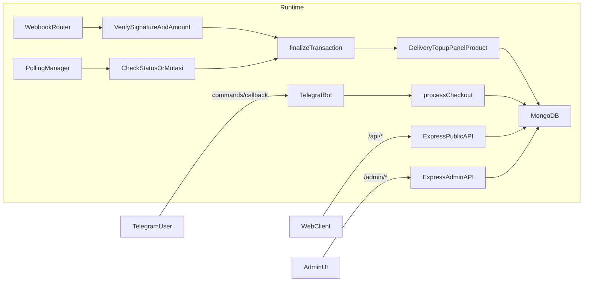

# Runtime Map — BOT-AUTO-ORDER

Dokumen ini menjelaskan **alur runtime** dan **alur data end-to-end** berdasarkan implementasi aktual (bukan dokumentasi provider).

## Komposisi proses (startup → steady-state)

- **Entrypoint**: `npm start` menjalankan `bot.js`.
- **HTTP server** dibuat lewat `server/httpServer.js` dan lifecycle startup dijalankan via `server/botLifecycle.js`.
- Setelah bot jalan, sistem masuk steady-state:
  - menerima interaksi Telegram (Telegraf)
  - melayani HTTP API (Express)
  - memproses pembayaran melalui webhook + polling
  - mengeksekusi finalisasi transaksi + delivery
  - menjalankan scheduler (broadcast, housekeeping pending/stale, voucher activation)

## Diagram high-level

## Alur transaksi end-to-end

### 1) Checkout (membuat transaksi `PENDING`)

Sumber utama: `features/checkout/processCheckout.js`.

- User memilih produk / topup / paket panel.
- Sistem menghitung total (termasuk fee QR).
- Sistem membuat `Transaction` `PENDING` berisi:
  - `paymentProvider`, `paymentMethod`, `paymentCountry`, `currency`
  - `totalBayar` dan `externalPayAmount` (nilai bayar yang diverifikasi pada provider)
  - `paymentReference` (jika provider memberi ID referensi untuk status check)
- Sistem mengirim QR ke user dan menyimpan `paymentMessageId/paymentMessageChatId` agar bisa dihapus saat sukses.

### 2) Verifikasi pembayaran

Ada dua jalur yang sama-sama menuju `finalizeTransaction`:

#### A. Webhook

Sumber utama: `routes/webhooks.js`.

- Callback masuk ke endpoint provider (mis. `/tripay-callback`, `/midtrans-webhook`, dll).
- Handler memverifikasi:
  - signature (HMAC/RSA/hash, tergantung provider)
  - reference (`refId` / `merchant_ref` / `order_id`)
  - amount (dibandingkan dengan nilai dari `getCheckAmount(transaction)`)
- Jika valid dan status “paid”, handler memanggil `finalizeTransaction`.

#### B. Polling

Sumber utama: `services/payment/polling.js`.

- Polling mengambil transaksi `PENDING` yang “recent window” per provider (`paymentProvider`, `status`, `waktuDibuat`).
- Polling melakukan check status/mutasi ke provider, lalu jika status sukses memanggil `finalizeTransaction`.

### 3) Finalisasi (idempotent) + delivery

Sumber utama: `services/transactionFinalize.js`.

- `finalizeTransaction` melakukan **atomic claim** dari `PENDING → PROCESSING` untuk mencegah:
  - webhook dan polling memproses transaksi yang sama secara paralel
  - retry provider memicu double delivery
- Lalu bercabang berdasarkan `transaction.produkInfo.type`:
  - `TOPUP`: tambah saldo user → set `SUCCESS` → notify user + channel.
  - `PANEL`: provisioning/extend panel → set `SUCCESS`.
  - `PRODUCT`:
    - `deliveryType=MANUAL`: set flag manual order → `SUCCESS` → notify user + admin queue.
    - `deliveryType=AUTO`: ambil stok/konten → isi `stokDikirim` → `SUCCESS` → kirim hasil.

## Field penting pada `Transaction`

Sumber: `models/Transaction.js`.

- `refId`: reference internal transaksi (unique).
- `status`: `PENDING | PROCESSING | SUCCESS | FAILED | ...`.
- `paymentProvider`: gateway (QR-based).
- `paymentMethod`: `QRIS | DUITNOW | PAYNOW | BALANCE`.
- `externalPayAmount`: nominal yang diverifikasi saat callback/polling.
- `paymentReference`: reference dari provider (jika diperlukan untuk status check).
- `gatewayTransactionId`: “claim key” untuk mutasi agar tidak double-claim (terutama provider mutasi).
- `finalizedBy`: audit trail {source, at}.

